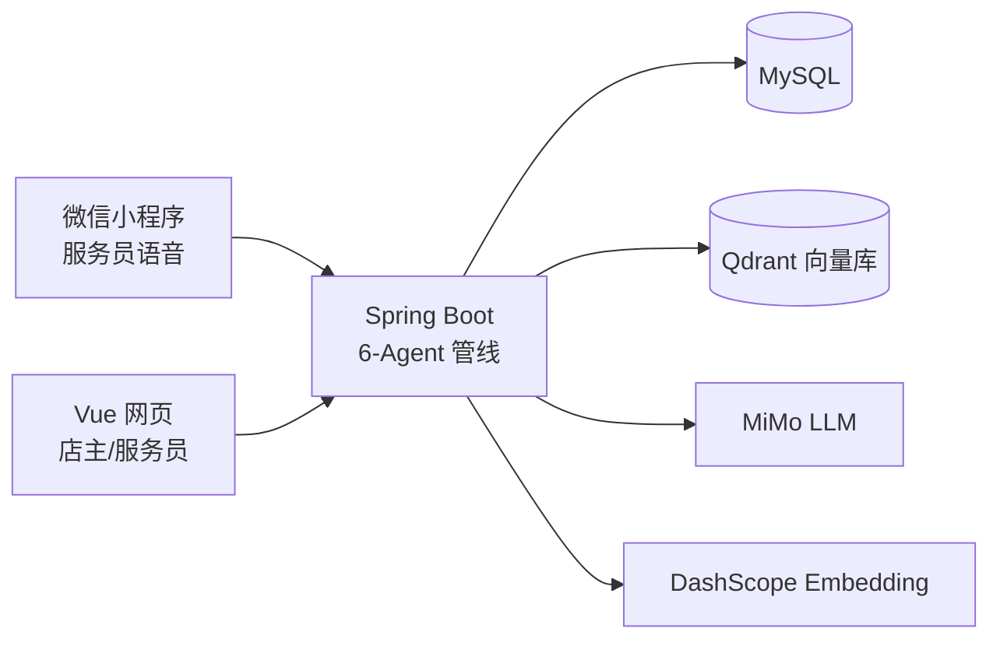

# 智能餐饮推荐系统

> 双角色（店主 / 服务员）+ 三端入口（店主 Web、服务员 Web、服务员微信小程序语音）+ 6-Agent 推荐管线的智能餐饮推荐毕业设计。


<!-- CI badge added in Task 6 -->

## 系统架构



## 快速开始

```bash
git clone <repo>
cp .env.example .env  # 填入你的 MIMO_API_KEY 等
docker compose up -d  # MySQL + Qdrant + Backend
cd food-recommend-frontend && npm install && npm run dev
```

完整步骤见 [部署手册](docs/deployment.md)。

## 文档导航

| 文档 | 说明 |
|---|---|
| [产品技术白皮书](docs/whitepaper.md) | 产品定位、6-Agent 架构、核心业务流 |
| [开发者上手](docs/dev-guide.md) | 环境前置、目录结构、常见任务 |
| [架构与技术方案](docs/architecture.md) | 三端拓扑、时序图、ER 图、鉴权流程 |
| [部署手册](docs/deployment.md) | docker-compose 一键启动详解 |
| [API 速查表](docs/api.md) | 所有 REST 端点 + 请求/响应示例 |

## 截图

（演示截图见 [docs/screenshots/](docs/screenshots/)）

## License

MIT
