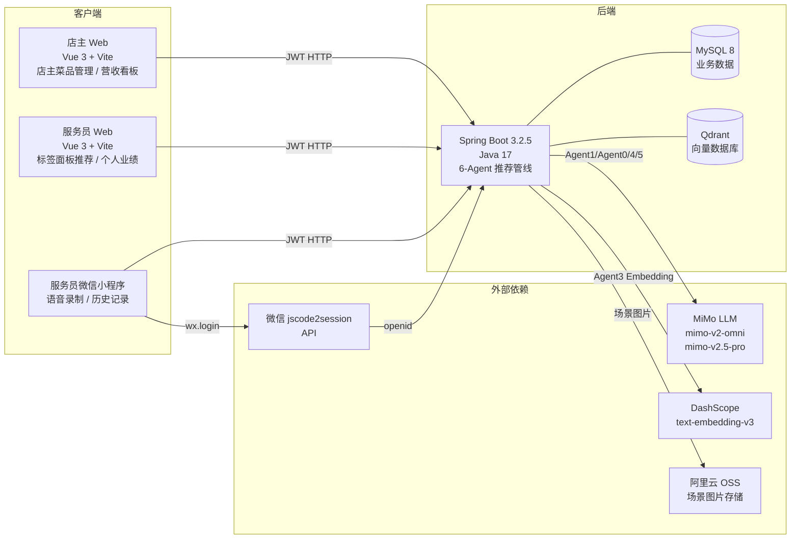
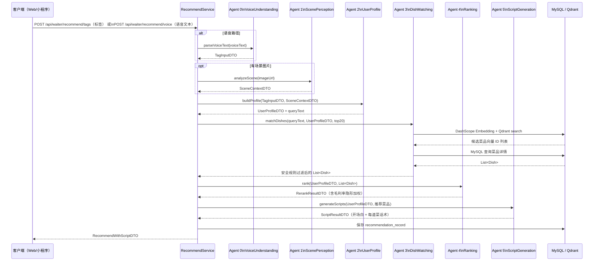
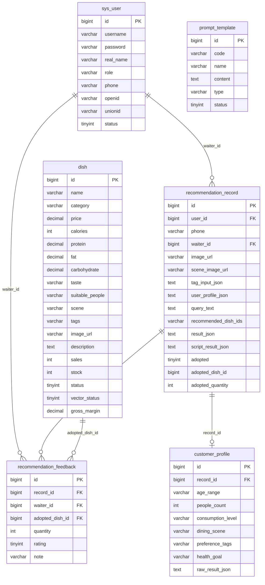

# 智能餐饮推荐系统 · 架构与技术方案

---

## 图一：三端拓扑图



---

## 图二：6-Agent 推荐时序图



---

## 图三：ER 图



---

## 图四：JWT 鉴权流程

```mermaid
flowchart TD
  subgraph 密码登录路径
    PW_REQ[POST /api/auth/login<br/>username + password] --> PW_VERIFY{校验密码<br/>BCrypt}
    PW_VERIFY -- 通过 --> JWT_ISSUE[签发 JWT<br/>包含 userId + role]
    PW_VERIFY -- 失败 --> PW_ERR[401 Unauthorized]
  end

  subgraph 微信登录路径
    WX_REQ[POST /api/auth/wx-login<br/>code] --> WX_API[调用微信 jscode2session<br/>获取 openid]
    WX_API --> WX_LOOKUP{查 sys_user<br/>WHERE openid = ?}
    WX_LOOKUP -- 存在 --> JWT_ISSUE
    WX_LOOKUP -- 不存在 --> WX_CREATE[创建 WAITER 账号<br/>写入 openid]
    WX_CREATE --> JWT_ISSUE
  end

  JWT_ISSUE --> TOKEN[返回 JWT Token]

  TOKEN --> API_REQ[后续请求<br/>Authorization: Bearer token]
  API_REQ --> FILTER[JwtAuthenticationFilter<br/>解析 + 验签]
  FILTER -- 有效 --> SECURITY[写入 SecurityContext<br/>userId + role]
  FILTER -- 无效/过期 --> ERR401[401 Unauthorized]

  SECURITY --> OWNER_API[/api/owner/**<br/>需要 OWNER 角色]
  SECURITY --> WAITER_API[/api/waiter/**<br/>需要 WAITER 角色]
```

---

## 图五：向量构建与检索流程

```mermaid
flowchart TD
  subgraph 菜品向量构建（批量初始化 / 单菜品重建）
    DISH_DB[(MySQL dish 表)] --> BUILD_TEXT[拼接 embeddingText<br/>名称+分类+价格+口味+适合人群+场景+标签]
    BUILD_TEXT --> EMBED_API[DashScope<br/>text-embedding-v3<br/>输出 1024 维向量]
    EMBED_API --> QDRANT_UPSERT[Qdrant upsert<br/>id=dishId<br/>vector=1024维<br/>payload=菜品元数据]
    QDRANT_UPSERT --> UPDATE_STATUS[MySQL dish.vector_status = 1]
  end

  subgraph 推荐时检索
    QUERY[Agent 2 生成 queryText<br/>基于 UserProfileDTO] --> EMBED_QUERY[DashScope<br/>text-embedding-v3<br/>输出 1024 维查询向量]
    EMBED_QUERY --> QDRANT_SEARCH[Qdrant search<br/>top-20 相似菜品 ID]
    QDRANT_SEARCH --> MYSQL_FETCH[MySQL 查询菜品详情]
    MYSQL_FETCH --> SAFETY_FILTER[Agent 3 安全规则过滤<br/>清真 / 过敏源 / 疾病 / 素食]
    SAFETY_FILTER --> AI_RERANK[Agent 4 LLM 重排序<br/>结合 gross_margin 加权]
    AI_RERANK --> RESULT[最终推荐菜品列表]
  end
```
