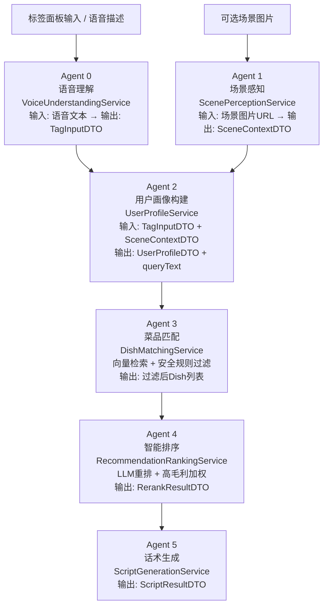

# 智能餐饮推荐系统 · 产品技术白皮书

> **多人口味 + 忌口/过敏 + 疾病三合一智能配餐 AI**  
> 定位："不是推荐'最好吃'，是推荐'最适合这一桌人'"

---

## 一、产品定位

本系统是一套面向线下堂食场景的智能餐饮推荐毕业设计项目。系统针对多人聚餐口味冲突、食品安全风险、服务效率低等痛点，提供标签输入或语音输入两条路径，由 6-Agent AI 管线自动生成兼顾全桌安全与长期偏好的定制配餐方案及服务员口语化推荐话术。

---

## 二、双角色 + 三端入口

系统支持两类登录角色：

| 角色 | 端入口 | 主要功能 |
|---|---|---|
| **店主（OWNER）** | 店主 Web（Vue） | 菜品管理、全局营收看板、推荐溯源 |
| **服务员（WAITER）** | 服务员 Web（Vue） | 标签面板推荐、历史记录、个人业绩看板 |
| **服务员（WAITER）** | 服务员微信小程序（语音） | 语音输入 → Agent 0 → 同一 6-Agent 管线 |

三端共用同一后端，微信小程序通过 `wx.login()` 换取 `openid` 后由 JWT 鉴权接入。

---

## 三、6-Agent 推荐管线架构图

标签推荐路径跳过 Agent 0，直接从 Agent 1 开始。

---

## 四、每个 Agent 的输入/输出/调用模型

| Agent | 服务类 | 输入 | 输出 | 调用模型 |
|---|---|---|---|---|
| Agent 0 — 语音理解 | `VoiceUnderstandingService` | 服务员语音转文本（String） | `TagInputDTO` | MiMo mimo-v2.5-pro |
| Agent 1 — 场景感知 | `ScenePerceptionService` | 场景图片 URL | `SceneContextDTO` | MiMo mimo-v2-omni（多模态） |
| Agent 2 — 用户画像 | `UserProfileService` | `TagInputDTO` + `SceneContextDTO` | `UserProfileDTO` + queryText | 无外部模型（规则拼接） |
| Agent 3 — 菜品匹配 | `DishMatchingService` | queryText + `UserProfileDTO` | `List<Dish>` | DashScope text-embedding-v3 + Qdrant |
| Agent 4 — 智能排序 | `RecommendationRankingService` | `UserProfileDTO` + `List<Dish>` | `RerankResultDTO` | MiMo mimo-v2.5-pro |
| Agent 5 — 话术生成 | `ScriptGenerationService` | `UserProfileDTO` + 推荐菜品 | `ScriptResultDTO` | MiMo mimo-v2.5-pro |

---

## 五、核心业务流

### 5.1 标签推荐流程

1. 服务员在标签面板勾选人数、口味偏好、忌口、过敏源、疾病等标签，可选上传场景图片。
2. Agent 1（可选）分析场景图片，补充环境信息。
3. Agent 2 合并标签与场景信息，生成结构化 `UserProfileDTO` 及向量检索文本 `queryText`。
4. Agent 3 通过 DashScope Embedding 将 queryText 向量化，在 Qdrant 中检索 top-20 候选菜品，再经安全规则过滤。
5. Agent 4 将候选菜品送入 LLM 重排序，结合毛利率隐形加权。
6. Agent 5 生成服务员可直接朗读的开场白与每道菜推荐话术。
7. 推荐结果保存至 `recommendation_record` 表，服务员确认采纳后扣减库存并记录反馈。

### 5.2 语音推荐流程

服务员在微信小程序按住录音按钮，语音经微信 RecorderManager 录制并通过 `POST /api/waiter/recommend/voice` 发送给后端 Agent 0。Agent 0 将语音描述解析为与标签面板等价的 `TagInputDTO`，之后走与标签推荐完全相同的 Agent 1-5 管线。

### 5.3 反馈采纳与库存扣减

服务员提交 `POST /api/waiter/feedback/{recordId}`，指定采纳的菜品 ID 与数量。后端更新 `recommendation_feedback` 表、扣减 `dish.stock`，并计算该服务员当次推荐产生的销售额（价格 × 数量），累计进营收看板。

### 5.4 营收统计

- 服务员视图（`GET /api/waiter/revenue`）：显示个人历史推荐次数、采纳率、累计销售额。
- 店主看板（`GET /api/owner/analytics/overview`）：显示全局总销售额、今日推荐数、在岗服务员人数及服务员销售额排行榜。

---

## 六、关键创新点

### 6.1 多人配菜安全过滤（Agent 3 硬规则）

`DishMatchingService.isSafeForAtLeastOne()` 实现以下硬拦截：
- **清真防线**：整桌任意一人要求清真时，含猪/排骨/大肠/培根/火腿等成分的菜品全部拦截。
- **过敏源防线**：海鲜过敏者自动屏蔽含鱼/虾/蟹/贝/蚝的菜品（"鱼香"类菜名例外）；花生过敏者屏蔽花生/坚果。
- **疾病防线**：糖尿病患者屏蔽甜/糖醋/蜜汁/双皮奶/红豆类菜品；痛风患者屏蔽海鲜/内脏/浓汤；高血压患者屏蔽腌腊/炸/麻辣类菜品。
- **素食防线**：标注素食的顾客，含肉/禽/鱼/蟹等动物性原料的菜品全部拦截。

只要候选菜品对至少一位顾客安全，该菜品才保留进入排序阶段。

### 6.2 长期记忆与口味偏好学习

服务员输入顾客手机号后，系统查询 `recommendation_record` 表中该手机号的历史采纳菜品，通过分析菜品口感特征（酸/甜/麻/辣/嫩等维度）推导出顾客的长期口味偏好，并自动注入当次推荐的 `UserProfileDTO`。

### 6.3 向量检索 + AI 重排两层架构

- **第一层：Qdrant 向量检索**：菜品描述文本通过 DashScope `text-embedding-v3` 生成 1024 维向量存储至 Qdrant，推荐时 queryText 同样 Embedding 后进行语义相似度检索，召回 top-20 候选菜品。
- **第二层：LLM AI 重排**：Agent 4 调用 MiMo LLM，结合顾客画像、菜品毛利率（`dish.gross_margin` 字段）进行综合重排序，在保证推荐合理性的前提下自然提升高毛利菜品的排名。

---

## 七、技术选型理由

| 技术 | 选型理由 |
|---|---|
| Spring Boot 3.2.5 / Java 17 | 生态成熟，MyBatis Plus 简化 CRUD，Spring Security + JWT 提供双角色权限隔离 |
| Vue 3 + Vite + Element Plus | 现代前端框架，SPA 单页应用，响应式看板开发效率高 |
| 微信小程序 | 服务员无需安装 App，扫码即用，RecorderManager 原生支持语音录制 |
| MySQL 8 | 菜品、推荐记录、反馈等结构化业务数据存储 |
| Qdrant | 高性能向量数据库，支持 payload 过滤，适合菜品语义检索场景 |
| DashScope text-embedding-v3 | 阿里云 1024 维 Embedding 模型，中文语义理解好，按 token 计费低成本 |
| MiMo LLM (mimo-v2-omni / mimo-v2.5-pro) | 小米 MiMo 平台，mimo-v2-omni 支持多模态场景分析，mimo-v2.5-pro 用于重排序与话术生成 |
| 阿里云 OSS | 场景图片存储，本地开发可用 mock 地址跳过 |
